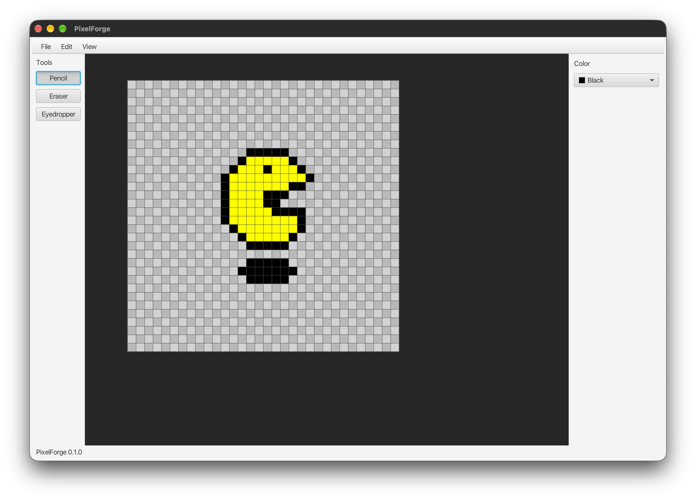

# Mirage

Mirage is a cross-platform pixel-art editor written in **Java + JavaFX**.



## Technology

- Java 25 LTS
- JavaFX 25
- Maven
- JUnit 5

The editor core is deliberately separated from JavaFX so image/document logic can be tested independently.

## Current starter status

The included base implements:

- Maven project
- JavaFX application
- Pixel image buffer
- Pixel-perfect Canvas rendering
- Zoom and pan
- Pixel grid
- Pencil
- Eraser
- Eyedropper
- Fill Bucket (four-connected regions; uses the selected color)
- General-purpose symmetry for pencil and eraser strokes: vertical and
  horizontal mirrors, adjustable gridline axes, and up to 12 radial copies
- Color selection
- New document
- PNG/JPEG/GIF open and PNG/JPEG/GIF export
- Basic undo/redo command architecture
- Unit tests for the pixel image model

## Running

Run the JavaFX application (requires Maven):

```bash
mvn javafx:run
```

Run tests:

```bash
mvn test
```

## MCP pixel-art tools

Mirage includes an optional stdio MCP server so coding agents can create
and draw on the canvas shown in the desktop window. Build the app first with
`mvn package`. In VS Code, the checked-in `.vscode/mcp.json` registers the
server and writes images to `pixel-art-output/` in the workspace. Starting the
MCP server starts a separate Java process and also opens Mirage; use that
window to watch the agent draw. To allow Mirage tools without repeated
approval prompts, run **Chat: Manage Tool Approval** in VS Code and trust all
tools under the Mirage MCP server. VS Code stores tool approvals outside
`.vscode/mcp.json`, so they are not shared through the workspace config.

The server provides:

- `create_canvas` — create a transparent canvas up to 1024 × 1024 pixels
- `draw_pixels` — set up to 10,000 pixels per call using `#RRGGBB` or
  `#AARRGGBB` colors; batch pixels into as few calls as practical. Both
  drawing tools accept optional `symmetry` settings for vertical/horizontal
  mirroring and up to 12 radial copies, with adjustable gridline axes.
- `draw_shape` — draw a line, rectangle, ellipse, or 3–64 point polygon as one
  undoable action; rectangles, ellipses, and polygons can be filled, up to
  250,000 affected pixels per shape
- `inspect_canvas` — inspect up to a 64 × 64 region as a coordinate-labeled
  character grid with an exact ARGB legend
- `preview_canvas` — return the current canvas as an image for visual review,
  without saving or modifying it
- `preview_region` — return an enlarged canvas crop with a visible pixel grid
  (up to 64 × 64 source pixels, scale 1–16; defaults to 8) for close-up review
- `bucket_fill` — fill the connected region containing a pixel with the
  selected editor color, or provide an optional `color`
- `save_png` — export the current canvas as a PNG

For reliable agent-driven drawing, make canvas changes sequentially: create the
canvas, inspect it, draw large silhouettes with filled shapes, add details with
`draw_pixels`, inspect the changed region, and use `preview_region` to zoom into
details while refining them. Save only after reviewing the result with
`preview_canvas`. Do not issue create, draw, or save calls in parallel; each call
acts on the same live document, and each drawing call is independently undoable.

To run the server manually, use:

```bash
java -jar target/mirage-0.1.0-SNAPSHOT.jar \
  --mcp --output-dir pixel-art-output
```

MCP edits are applied to the visible document, redraw the canvas immediately,
and are included in undo/redo (each `draw_pixels` call is one undo step). The
server accepts PNG file names (not paths)
and keeps exports inside the configured output directory. The MCP-launched
window is the live editing session; a separately launched desktop window is
not shared with it. Closing the MCP-launched window shuts down the app and its
MCP server.

Build the project and run tests:

```bash
mvn clean package
```

The runnable JAR is written to `target/mirage-0.1.0-SNAPSHOT.jar`. Launch it with:

```bash
java -jar target/mirage-0.1.0-SNAPSHOT.jar
```

The JAR includes JavaFX native libraries for the OS and CPU architecture on which it was built. Build it separately on each target platform.

## Releases

Push a version tag such as `v0.1.0` to build and publish a GitHub Release with runnable JARs for macOS ARM64 and Windows x64:

```bash
git tag v0.1.0
git push origin v0.1.0
```


## Initial controls

- `P` — Pencil
- `E` — Eraser
- `I` — Eyedropper
- `F` — Fill Bucket
- Symmetry controls in the Color panel — mirror across either axis, position
  the symmetry axes, and set radial copies (1 disables radial symmetry)
- Click or drag on the canvas with the Eyedropper to sample a pixel into the color picker
- Click a region with the Fill Bucket to replace its connected pixels with the selected color
- `Ctrl/Cmd + Z` — Undo
- `Ctrl/Cmd + Y` — Redo
- Mouse wheel — Zoom
- Middle mouse — Pan

## Project structure

```text
pixelforge/
├── README.md
├── ROADMAP.md
├── LICENSE
├── build.mvn
├── settings.mvn
├── mvn.properties
├── .gitignore
└── src/
    ├── main/
    │   ├── java/com/pixelforge/
    │   │   ├── App.java
    │   │   ├── core/
    │   │   │   ├── document/Document.java
    │   │   │   └── image/
    │   │   │       ├── PixelImage.java
    │   │   │       └── PixelColor.java
    │   │   ├── commands/
    │   │   │   ├── Command.java
    │   │   │   ├── CommandManager.java
    │   │   │   └── SetPixelCommand.java
    │   │   ├── rendering/CanvasRenderer.java
    │   │   ├── tools/
    │   │   │   ├── Tool.java
    │   │   │   ├── PencilTool.java
    │   │   │   ├── EraserTool.java
    │   │   │   ├── EyedropperTool.java
    │   │   │   └── FillBucketTool.java
    │   │   └── ui/MainWindow.java
    │   └── resources/
    └── test/
        └── java/com/pixelforge/core/image/PixelImageTest.java
```

## Architecture

The key rule is:

> The editor core should not depend on JavaFX.

```text
                 JavaFX UI
                     |
                     v
                MainWindow
                     |
                     v
                 Core Model
                     |
          +----------+----------+
          |          |          |
       Images     Commands   Document
          |
          v
      Renderer
          |
          v
     JavaFX Canvas
```

The application does **not** create one JavaFX Node per pixel. Pixel data is stored in a compact `int[]` buffer and rendered through a JavaFX Canvas.

## Pixel representation

Pixels use `0xAARRGGBB`.

Examples:

```text
0xFFFF0000 = opaque red
0xFF00FF00 = opaque green
0xFF0000FF = opaque blue
0x00000000 = transparent
```

## Next development target

After this starter, implement v0.2:

1. Layers
2. Layer visibility/locking/opacity
3. Rectangle selection
4. Copy/cut/paste
5. Move selection
6. Layer-aware undo/redo

See `ROADMAP.md` for the full v0.1 → v1.0 plan.


## Build and run

Mirage uses Maven rather than Gradle.

```bash
mvn clean test
mvn javafx:run
mvn package
```

Requirements:
- JDK 25+
- Maven 3.9+
- Internet access on the first build so Maven can download JavaFX and test dependencies.

Maven stores downloaded dependencies in `~/.m2/repository`; the project itself does not contain a Gradle wrapper or Gradle distribution.
